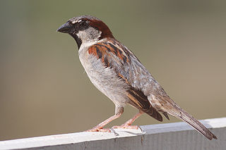
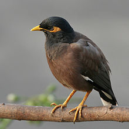
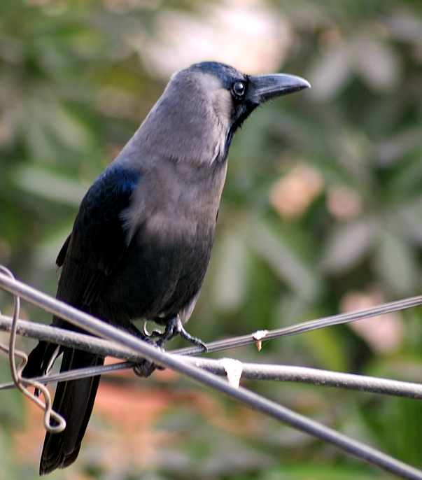

<a href="question-3.html" class="btn btn-primary btn-large">Sparrow or smaller</a>    <a href="question-142.html" class="btn btn-primary btn-large">Sparrow to Myna</a>   <a href="question-298.html" class="btn btn-primary btn-large">Myna to Crow</a>   <a href="question-412.html" class="btn btn-primary btn-large">Larger than crow</a>

Notes

Size is always reckoned by comparing the bird with one of the three extremely common species which almost everyone knows already. Measurements given  are from the tip of the bill to the tip of the tail. Here you have to decide how the bird compares in size with a sparrow. 

###Sparrow (15cms)     

###Myna (23 cms)   

###Crow(43cms)    
 

<a href="http://www.treknature.com/gallery/photo155694.htm">Image Credit: Ram Thakur</a>

---
Interesting!
Birds very close to sparrow size will be reached whichever answer is chosen! 